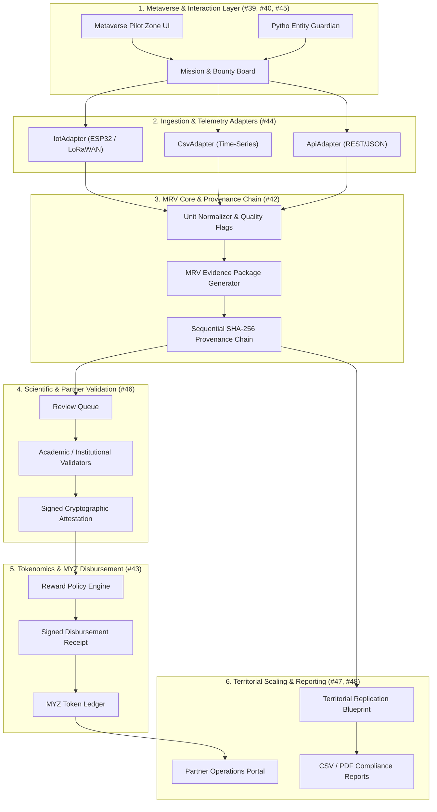

# MyZubster Environmental Metaverse Specification

**Version:** 0.1.0  
**Status:** Architecture Baseline & Production Specification  
**Roadmap Scope:** Issues #31–#48  
**Core Target:** Resolves Issue #41 (P0)

---

## 1. Vision & Core Philosophy

MyZubster Environmental Metaverse connects interactive digital worlds, entity-driven missions, real-world IoT telemetry, and scientific MRV (Monitoring, Reporting, and Verification) to create an auditable economic loop:

```text
Metaverse → Environmental Mission → Bounty → Proof → Sensor/Data Evidence → MRV Core → Validation → MYZ Reward → Audit/Provenance → Replication/LIFE
```

The metaverse serves as the spatial interaction and visualization layer. It strictly enforces cryptographic provenance so simulated, synthetic, or unvalidated data streams are never misrepresented as certified ecological claims.

---

## 2. End-to-End Architecture Diagram



---

## 3. Evidence Levels Taxonomy

To maintain regulatory rigor and avoid greenwashing, every evidence packet is classified into one of four immutable tiers:

| Evidence Level | Definition & Ingestion Channel | Quality Assurance Criteria | MYZ Reward Eligibility |
| :--- | :--- | :--- | :---: |
| `demo` | Synthetic, unit-test, or benchmark data streams | Labeled `SIMULATED`; excluded from MRV credits | 0 MYZ (Sandbox only) |
| `user-reported` | Community observational uploads (photos, GPS tags) | Baseline plausibility & heuristic filter | Policy-dependent (25 MYZ) |
| `sensor-backed` | Authenticated hardware IoT node (e.g. NDIR CO2, DHT22) | Boundary protection & cryptographic provenance hash | Eligible (100 MYZ) |
| `partner-validated` | Attested by certified university, utility, or NGO auditor | Multi-signature attestation & conflict-of-interest check | Highest tier (250 MYZ) |

---

## 4. Roles & Permission Matrix

| Role | Mission Creation | Evidence Submission | Evidence Review | Reward Claim | Audit Inspection |
| :--- | :---: | :---: | :---: | :---: | :---: |
| **Participant** | ❌ | ✅ | ❌ | ✅ | Public Scope |
| **Issuer** | ✅ | ❌ | ❌ | ❌ | Full Scope |
| **Entity / NPC** | Dialogue only | ❌ | ❌ | ❌ | Narrative only |
| **Validator** | ❌ | ❌ | ✅ | ❌ | Verification Scope |
| **Partner** | Sponsored only | ❌ | ❌ | ❌ | Territorial Scope |
| **Auditor** | ❌ | ❌ | Read-only | ❌ | Cryptographic Audit |

---

## 5. Mission & Bounty Lifecycle State Machine

The life cycle of an environmental bounty proceeds through 9 deterministic states:

```text
draft → published → available → claimed → in_progress → submitted → validation → approved → rewarded
                                                                       ↓
                                                                   rejected
```

- **Anti-Replay Protection**: Claims register an atomic hash on the ledger preventing double payouts.
- **Revocation Protocol**: If post-disbursement audits uncover sensor fault or fraud, rewards are flagged `REVOKED` with audit trail justification.

---

## 6. Differentiators Against Legacy Carbon Markets

| Feature | Legacy Standards (Verra / Gold Standard) | MyZubster Environmental Metaverse |
| :--- | :--- | :--- |
| **Ingestion Latency** | Months to years (manual PDF audits) | Milliseconds to seconds (continuous IoT streaming) |
| **Gamification** | Non-existent; institutional silos | Interactive 3D spatial metaverse & community bounties |
| **Auditability** | Opaque third-party consulting reports | Public SHA-256 sequential cryptographic provenance chains |
| **Micro-Rewards** | Minimum project sizes > $100,000 | Fractional MYZ micro-incentives for local biodiversity actions |

---

## 7. Ecosystem Cross-References
- **#31–#38**: Metaverse Foundation, Space Station 3D Canvas, and Asset Pipeline.
- **#39–#40**: Metaverse Bounty Board & Publisher Interfaces.
- **#42**: Environmental MRV Core, Provenance & Evidence Package Schemas.
- **#43**: Environmental Bounty Validation & MYZ Reward Policy Engine.
- **#44**: Multi-Source Telemetry Adapter Layer (API / CSV / IoT).
- **#45**: LIFE Metaverse Pilot Zone & Digital Twin Engine.
- **#46**: Scientific & Academic Partner Validation Workflow.
- **#47**: Territorial Replication Blueprints & Regional Scaling.
- **#48**: Partner Operations Portal & Multi-Format Environmental Exporters.
